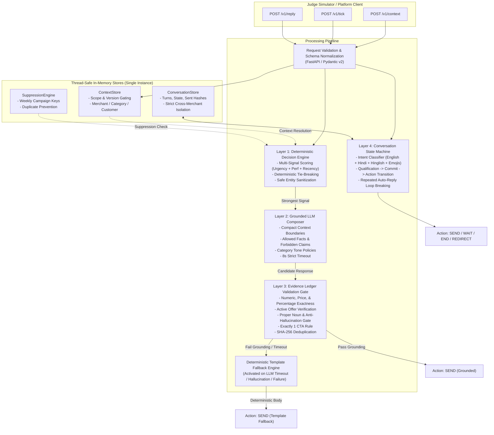

# Magicpin "Vera" Merchant-Growth Bot Service

[](magicpin-bot/tests/)
[](magicpin-bot/tests/)
[](#architecture)

Production-ready, highly resilient FastAPI service for the **Magicpin AI Challenge** ("Vera" merchant-growth bot).

This service implements the 6 HTTP endpoints specified in the official challenge testing brief, featuring a **deterministic multi-signal decision engine**, a **grounded LLM message composer** with category voice policies, a **strict evidence ledger validation gate** that intercepts hallucinations, and an **adaptive conversation state machine** supporting Indic Hindi/Hinglish/Emoji intent recognition.

---

## ⚠️ Critical Architectural Constraint: Single-Instance Enforcement

> [!IMPORTANT]
> **ContextStore** and **ConversationStore** in `magicpin-bot/app/store.py` are in-memory, thread-safe, and **process-local**.
> 
> **MANDATORY DEPLOYMENT RULE**:
> 1. The service **MUST** run as a **single instance** (`numInstances: 1` on Render). Autoscaling and multiple replicas **MUST BE DISABLED**.
> 2. The Uvicorn process **MUST** run with **`--workers 1`**.
>
> **Why this matters**:
> If the platform runs 2+ instances or 2+ Uvicorn workers, incoming requests are load-balanced across isolated memory spaces. A context pushed via `/v1/context` to Instance A would not exist in Instance B when processing `/v1/tick`, causing silent state fragmentation and evaluation failures. The included `Dockerfile` and `render.yaml` enforce `--workers 1` and `numInstances: 1` by default.

---

## 🏛️ Architecture Overview

The system processes incoming ticks and replies through a four-layer defense-in-depth pipeline:



---

## 🚀 Quickstart & Local Setup

```bash
# Navigate to bot directory
cd magicpin-bot

# Install dependencies
pip install -r requirements.txt

# Run single-worker service
uvicorn app.main:app --host 0.0.0.0 --port 8080 --workers 1
```

---

## 🧪 Verification & Test Suite

```bash
cd magicpin-bot
python -m pytest tests/ --cov=app --cov-report=term-missing -v
```

All **118 tests pass** at **95% coverage** in < 2 seconds.

---

## ☁️ Deployment Guide (Render)

### Deploy via Render Blueprint

1. Push this repository to GitHub (`https://github.com/Yashdeep1546/magic-pin-project.git`).
2. In [Render Dashboard](https://dashboard.render.com/), select **New** -> **Blueprint**.
3. Select this repository. Render automatically reads `render.yaml`:
   - Enforces **`numInstances: 1`** (Autoscaling disabled).
   - Configures health check path `/v1/healthz`.
   - Runs single worker `uvicorn app.main:app --host 0.0.0.0 --port $PORT --workers 1`.
4. In Environment Variables, supply `OPENAI_API_KEY`.
5. Click **Apply**.

---

## 📋 Public URLs for Judge Submission

| Resource | Public URL | Description |
| :--- | :--- | :--- |
| **Service Root** | `https://magicpin-vera-bot.onrender.com` | Base URL of deployed bot |
| **Health Check** | `https://magicpin-vera-bot.onrender.com/v1/healthz` | Uptime & context statistics (Target for judge liveness) |
| **Metadata** | `https://magicpin-vera-bot.onrender.com/v1/metadata` | Team identity, model (`gpt-4o`), and approach description |
| **Context Ingestion** | `https://magicpin-vera-bot.onrender.com/v1/context` | Version-gated context updates |
| **Tick Evaluation** | `https://magicpin-vera-bot.onrender.com/v1/tick` | Proactive trigger evaluation & message composition |
| **Merchant Reply** | `https://magicpin-vera-bot.onrender.com/v1/reply` | Reactive conversation state machine |
