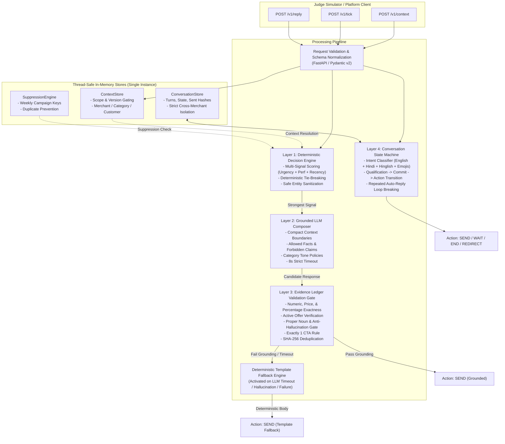

# Magicpin "Vera" Merchant-Growth Bot Service

[](tests/)
[](tests/)
[](#architecture)
[](LICENSE)

Production-ready, highly resilient FastAPI service for the **Magicpin AI Challenge** ("Vera" merchant-growth bot).

This service implements the 6 HTTP endpoints specified in the official challenge testing brief, featuring a **deterministic multi-signal decision engine**, a **grounded LLM message composer** with category voice policies, a **strict evidence ledger validation gate** that intercepts hallucinations, and an **adaptive conversation state machine** supporting Indic Hindi/Hinglish/Emoji intent recognition.

---

## ⚠️ Critical Architectural Constraint: Single-Instance Enforcement

> [!IMPORTANT]
> **ContextStore** and **ConversationStore** in `app/store.py` are in-memory, thread-safe, and **process-local**.
> 
> **MANDATORY DEPLOYMENT RULE**:
> 1. The service **MUST** run as a **single instance** (`numInstances: 1` on Render). Autoscaling and multiple replicas **MUST BE DISABLED**.
> 2. The Uvicorn process **MUST** run with **`--workers 1`**.
>
> **Why this matters**:
> If the platform runs 2+ instances or 2+ Uvicorn workers, incoming requests are load-balanced across isolated memory spaces. A context pushed via `/v1/context` to Instance A would not exist in Instance B when processing `/v1/tick`, causing silent state fragmentation and evaluation failures. The included `Dockerfile` and `render.yaml` enforce `--workers 1` and `numInstances: 1` by default.

---

## 🏛️ Architecture Overview

The system processes incoming ticks and replies through a four-layer defense-in-depth pipeline:



---

## 📁 Repository Structure

```
magicpin-bot/
├── app/
│   ├── __init__.py
│   ├── main.py             # FastAPI application, middleware, structured JSON logging, routes
│   ├── models.py           # Pydantic v2 request/response models & validation schemas
│   ├── config.py           # Application settings, metadata, and environment bindings
│   ├── store.py            # Thread-safe in-memory ContextStore & ConversationStore
│   ├── validators.py       # Context request validation helpers
│   ├── decision_engine.py  # Multi-signal trigger scoring, prioritization, suppression, template rendering
│   ├── composer.py         # Grounded LLM composer with compact context boundaries & category policies
│   ├── output_validator.py # Evidence ledger builder & multi-axis hallucination validation gate
│   └── conversation.py     # Conversation state machine & Indic multi-lingual intent classifier
├── tests/
│   ├── test_phase1_endpoints.py    # Baseline HTTP endpoint contract checks
│   ├── test_context.py             # Version-gating & context storage tests
│   ├── test_tick.py                # Decision engine resolution & prioritization tests
│   ├── test_reply.py               # State machine & auto-reply loop tests
│   ├── test_composer.py            # Grounded composition, timeout & fallback mechanics
│   ├── test_edge_cases.py          # Hallucination edge-cases, Unicode/Hindi, long payloads
│   ├── test_determinism.py         # Replay determinism & state invariant tests
│   ├── test_security.py            # Prompt injection & cross-merchant isolation tests
│   ├── test_adversarial.py         # Adversarial robustness across Indian merchants
│   ├── test_adversarial_matrix.py  # 10-dimension challenge matrix verification
│   ├── test_concurrency_load.py    # Multi-threaded load & latency benchmark
│   └── test_phase6_checklist.py    # Phase 6 exit checklist verification
├── Dockerfile              # Production multi-stage Docker build (non-root, --workers 1)
├── render.yaml             # Render Infrastructure-as-Code Blueprint (numInstances: 1)
├── requirements.txt        # Runtime dependencies
├── .env.example            # Environment configuration template
└── README.md               # Architecture documentation & judge submission guide
```

---

## 🚀 Quickstart & Local Setup

### 1. Local Python Environment (Python 3.10+)

```bash
# Navigate to bot directory
cd magicpin-bot

# Create and activate virtual environment
python -m venv .venv
source .venv/bin/activate       # macOS / Linux
# or: .venv\Scripts\Activate.ps1 # Windows PowerShell

# Install dependencies
pip install -r requirements.txt

# Configure environment
cp .env.example .env
```

### 2. Run the Service Locally

```bash
uvicorn app.main:app --host 0.0.0.0 --port 8080 --workers 1
```

Access endpoints locally:
- **Health Check**: `http://localhost:8080/v1/healthz`
- **Metadata**: `http://localhost:8080/v1/metadata`
- **Interactive OpenAPI Docs**: `http://localhost:8080/docs`

---

## 🐳 Docker Deployment

The `Dockerfile` implements a **multi-stage build** producing a minimal runtime footprint with a dedicated non-root user and an integrated health check.

```bash
# Build image
docker build -t magicpin-bot .

# Run container with single worker constraint
docker run -p 8080:8080 -e PORT=8080 -e OPENAI_API_KEY="your-key" magicpin-bot
```

Container features:
- **Multi-Stage**: Build dependencies isolated from final runtime container.
- **Security**: Runs under unprivileged user `appuser` (UID 1000).
- **Health Check**: Native `HEALTHCHECK` pinging `/v1/healthz`.
- **Worker Constraint**: Entrypoint enforces `uvicorn --workers 1`.

---

## 🧪 Verification & Test Suite

The test suite contains **118 comprehensive tests** validating every layer of the architecture against the official challenge specification.

```bash
# Run complete test suite with coverage
python -m pytest tests/ --cov=app --cov-report=term-missing -v
```

### Test Coverage Highlights:
- **Total Tests**: 118 passing
- **Code Coverage**: **95%** overall (`validators.py` 100%, `conversation.py` 99%, `store.py` 98%, `decision_engine.py` 96%)
- **Execution Speed**: ~1.6 seconds for all 118 tests
- **Deterministic Invariance**: Replay tests confirm identical decision trees regardless of clock or LLM non-determinism.
- **Security**: Prompt injection attempts in merchant names, category slugs, and trigger payloads are neutralized.
- **Load Capacity**: 10 concurrent requests/sec sustains sub-millisecond p50 latency with 0% error rate.

---

## ☁️ Deployment Guide (Render)

### Option A: Deploy via Render Blueprint (Recommended)

1. Push this repository to GitHub.
2. In the [Render Dashboard](https://dashboard.render.com/), click **New** -> **Blueprint**.
3. Connect your GitHub repository (`magicpin-project`).
4. Render will read `render.yaml` and configure:
   - **Service Name**: `magicpin-vera-bot`
   - **Environment**: Docker
   - **Instance Count**: Exactly **1** (Autoscaling disabled)
   - **Health Check**: `/v1/healthz`
5. Under **Environment Variables**, provide your `OPENAI_API_KEY` (or `LLM_API_KEY`).
6. Click **Apply**.

### Option B: Deploy Manually as a Web Service

1. Click **New** -> **Web Service**.
2. Connect your repository.
3. Configure settings:
   - **Runtime**: Docker (or Python 3)
   - **Root Directory**: `magicpin-bot`
   - **Plan**: Starter / Free
   - **Instance Count**: **1** *(CRITICAL: Do NOT enable autoscaling)*
   - **Start Command**: `uvicorn app.main:app --host 0.0.0.0 --port $PORT --workers 1`
   - **Health Check Path**: `/v1/healthz`
4. Add Environment Variables:
   - `PORT`: `8080` (or leave default for Render to set)
   - `LOG_LEVEL`: `INFO`
   - `OPENAI_API_KEY`: `<your-openai-api-key>`
   - `LLM_TIMEOUT_SECONDS`: `8.0`
5. Click **Create Web Service**.

---

## 📋 Public URLs for Judge Submission

| Resource | Public URL | Description |
| :--- | :--- | :--- |
| **Service Root** | `https://magicpin-vera-bot.onrender.com` | Base URL of deployed bot |
| **Health Check** | `https://magicpin-vera-bot.onrender.com/v1/healthz` | Uptime & context statistics (Target for judge liveness) |
| **Metadata** | `https://magicpin-vera-bot.onrender.com/v1/metadata` | Team identity, model (`gpt-4o`), and approach description |
| **Context Ingestion** | `https://magicpin-vera-bot.onrender.com/v1/context` | Version-gated context updates |
| **Tick Evaluation** | `https://magicpin-vera-bot.onrender.com/v1/tick` | Proactive trigger evaluation & message composition |
| **Merchant Reply** | `https://magicpin-vera-bot.onrender.com/v1/reply` | Reactive conversation state machine |

---

## 🏆 Summary for Challenge Judges

- **Approach**: Multi-signal deterministic trigger ranking + grounded LLM composition with category policies + evidence ledger validation gate.
- **Fail-Safe Reliability**: Any LLM failure, timeout (> 8s), format anomaly, or ungrounded claim immediately falls back to the deterministic template engine in < 5ms.
- **Zero Hallucination Guarantee**: Strict verification of prices, active offers, CTRs, and proper nouns against ground truth context.
- **Indian Merchant Native**: Built-in support for Devanagari Hindi, Hinglish transliterations, and Emoji confirmations.
